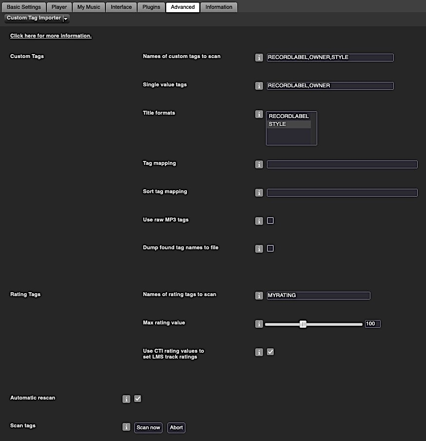

Custom Tag Importer
====

Custom Tag Importer[^1] scans track information from custom tags in your music files. That includes rating tags because a rating tag is basically just a custom tag for ratings.
  

I created this as a favour for a friend during a covid lockdown and uploaded it here in case anyone finds a use for it. 
I currently have no plans to add it to the main LMS repository as a supported plugin.

  
[⬅️ **Back to the list of all plugins**](https://github.com/AF-1/)
   

## Requirements

- LMS version >= 7.**9**
- LMS database = **SQLite**
   

## Screenshot

   

## Installation

### Using the repository URL

- Add the repository URL below at the bottom of *LMS* > *Settings* > *Plugins* and click *Apply*:
[https://raw.githubusercontent.com/AF-1/lms-customtagimporter/main/public.xml](https://raw.githubusercontent.com/AF-1/lms-customtagimporter/main/public.xml)

- Install the new version.
 

### Manual Install

Please read the instructions on how to [install a plugin manually](https://github.com/AF-1/sobras/wiki/Manual-installation-of-LMS-plugins).
   

[^1]:based on Erland's CustomScan plugin.
