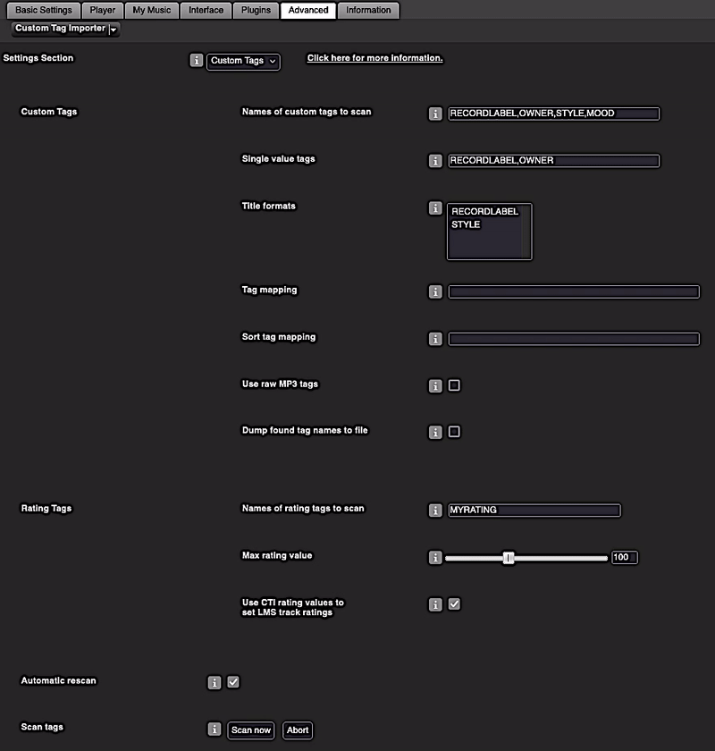

Custom Tag Importer
====

**Custom Tag Importer**[^1] scans track information from custom tags in your music files. That includes rating tags because a rating tag is basically just a custom tag for ratings.
  

[⬅️ **Back to the list of all plugins**](https://github.com/AF-1/)
  
**Use the** &nbsp;  &nbsp;**icon** (top right) to **jump directly to a specific section.**

  

## Screenshot[^2]

   

## Features

* **Scan track information from custom tags in your music files** to a dedicated LMS database table.

* **Scan rating values** from rating tags in your music files and use them **to set LMS track ratings**.

* Includes a **list of available CTI custom tags and their values**.

* Scan option: **Dump tag names found in your music files to a text file** to see what tags your files include.

* **Automatic rescan**: If you start an LMS rescan, a CTI rescan is performed as part of the LMS rescan (increases LMS rescan time accordingly).

* Create **title formats** using custom tags.

   

## Requirements

- LMS version >= 7.**9**
- LMS database = **SQLite**
   

## Installation

**Custom Tag Importer** is available from the LMS plugin library: **LMS > Settings > Manage Plugins**. 

If you want to test a new patch that hasn't made it into a release version yet, you'll have to [install the plugin manually](https://github.com/AF-1/sobras/wiki/Manual-installation-of-LMS-plugins).
   

## FAQ

»<b>What can I do with imported custom tags?</b>« &nbsp;&nbsp;&nbsp;&nbsp;»<b>Which plugins does CTI work with?</b>«
 

CTI stores custom tags and values in a separate LMS database table. Since this table is not part of the LMS default setup, LMS does <i>not</i> access or use keys or values from this table by default.  In other words, what you can do with them <b>depends on other plugins</b>. Here are some <i>examples</i>:  
&nbsp;&nbsp;&nbsp;- <a href="https://github.com/AF-1/#-dynamic-playlist-creator"><b>Dynamic Playlist Creator</b></a> / <a href="https://github.com/AF-1/#-dynamic-playlists"><b>Dynamic Playlists</b></a>: create/play smart playlists based on custom tag values  
&nbsp;&nbsp;&nbsp;- <a href="https://github.com/AF-1/#-virtual-library-creator"><b>Virtual Library Creator</b></a>: create virtual libraries (with optional browse menus) using custom tags  
&nbsp;&nbsp;&nbsp;- <b>CustomBrowse</b> (unsupported): create menus using custom tags  
&nbsp;&nbsp;&nbsp;- <a href="https://github.com/AF-1/#-custom-skip"><b>Custom Skip</b></a>: skip tracks with/without specific custom tags  

 

»<b>I have (de)selected a custom tag as a title format on the CTI settings page but it still only shows the name of the title format not the value.</b>«
 

I think title formats were not meant to be added and removed while the server is running. Restarting the server will load your new selection of custom tags as title formats.

   

## Report a new issue

To report a new issue please file a GitHub [**issue report**](https://github.com/AF-1/lms-customtagimporter/issues/new/choose).
   

## ⭐ Contributing

If you find this plugin useful, please consider giving it a  on GitHub (top right of this page) so that other users can discover it (in their News Feed).
    

[^1]:If you want localized strings in your language, please read <a href="https://github.com/AF-1/sobras/wiki/Adding-localization-to-LMS-plugins"><b>this</b></a>. Based on Erland's CustomScan plugin
[^2]: The screenshots might not correspond to the UI of the latest release in every detail.
